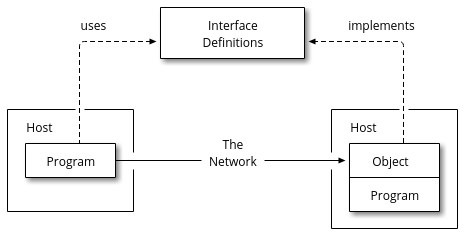

# Drawscii

Drawscii is a command-line program that converts ASCII drawings to proper
graphics files. Consider the following example drawing:

```
                 +---------------+
        uses     |   Interface   |   implements
        /------->|  Definitions  |<----------\
        |        +---------------+           |
        :                                    :
        |                                    |
+-------|-----+                     +--------|----+
| Host  |     |                     | Host   |    |
| +-----+---+ |         The         | +------+--+ |
| | Program +---------Network-------->| Object  | |
| +---------+ |                     | +---------+ |
|             |                     | | Program | |
+-------------+                     | +---------+ |
                                    +-------------+
```

This ASCII file is converted by Drawscii to the following image:



Drawscii can produce a variety of output formats, in particular PNG, SVG and
PDF.


## Table of Contents

- [Installation](#installation)
- [Usage](#usage)
- [Build](#build)
- [Acknowledgments](#acknowledgments)


## Installation

TODO


## Usage

TODO


## Build

Drawscii has these build dependencies:

- [Qt](https://www.qt.io) 5.x
- [Qbs](https://doc.qt.io/qbs/) 1.11+

Although we use the Qbs build system, there are wrapper scripts that enable
the standard Linux build commands:

    ./configure
    make
    make install


## Acknowledgments

I really like [ditaa](https://github.com/stathissideris/ditaa). Drawscii adopts
many of its features, while taking a somewhat different approach to parsing and
graphics output generation.
