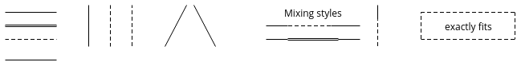
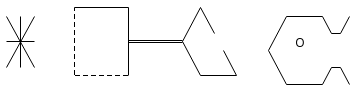
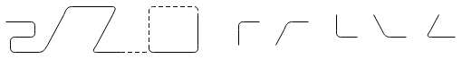
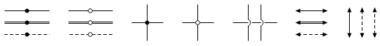

# Drawscii

Drawscii is a command-line program that converts ASCII drawings to proper
graphics files. Consider the following example drawing:

```txt <!-- doc/example-1.txt -->
                 +---------------+
        uses     |   Interface   |   implements
        .- - - ->|  Definitions  |<- - - - -.
        :        +---------------+          :
        :                                   :
        :                                   :
+-------:-----+                     +-------:-----+
| Host  :     |                     | Host  :     |
| +-----+---+ |         The         | +-----+---+ |
| | Program +---------Network-------->| Object  | |
| +---------+ |                     | +---------+ |
|             |                     | | Program | |
+-------------+                     | +---------+ |
                                    +-------------+
```

This ASCII file is converted by Drawscii to the following image:


Drawscii can produce a variety of output formats, in particular PNG, SVG and
PDF. This makes it the ideal tool for postprocessing ASCII drawings in Markdown
files and source code documentation, for example when using
[Pandoc](https://pandoc.org) to produce PDF documents.

*What is the difference to similar tools?*

The focus of Drawscii is producing high-quality graphics suitable for
"publication" in the web or in print. The text drawings in the original file
shall be easy to read and write for anyone, which is why Drawscii does not use
a graph programming language (such as [Graphviz](https://graphviz.org), for
example), and neither does it use special tags to produce fancy shapes. You're
down to boxes and arrows, mostly, but these are rendered very well.


## Table of Contents

- [Installation](#installation)
- [Usage](#usage)
- [Drawing](#drawing)
- [Build](#build)
- [Acknowledgments](#acknowledgments)


## Installation

On a Debian system, Drawscii can be installed from a PPA as follows:

    sudo add-apt-repository ppa:nixblik/ppa
    sudo apt-get update
    sudo apt-get install drawscii

Drawscii has a special [Ditaa](https://github.com/stathissideris/ditaa)
command-line compatibility mode. To use it, create a symlink, for example:

    sudo ln -s /usr/bin/drawscii /usr/local/bin/ditaa

Now you can use Drawscii with all programs that already provide integration for
Ditaa, for example [Pandoc](https://pandoc.org) with the
[Pandoc-Imagine](https://github.com/hertogp/imagine) filter.


## Usage

Here are some quick examples of how Drawscii can be used, and its most
important command-line options. For a complete reference, you can have a look
at its manpage or `drawscii --help` output.

Drawscii converts one text file at a time. The most basic call would be:

    drawscii input.txt -o output.png

The format of the output file is determined from its suffix, in this case PNG.
You can generate many other formats, the most important being SVG and PDF.

### Font Selection

As a default, Drawscii uses [Open Sans](https://www.opensans.com) with a size
of 12px, if available. But the font used for rendering can be customized:

    drawscii input.txt -o output.png --font "Roboto Slab" --font-size 16

This will also increase the size of the whole drawing. Drawscii computes the
scale of the output image from the height and width of the font. Just switching
the font may therefore widen or narrow the diagram slightly.

### Background Color

PNG files produced by Drawscii have a white background by default. That can
be changed to any color or, most importantly, to a transparent background:

    drawscii input.txt -o output.png --background #E0E0E0
    drawscii input.txt -o output.png --background transparent

SVG and PDF are transparent by default.

### Usage With Pandoc

I like to write documents in Markdown and use [Pandoc](https://pandoc.org) to
produce PDF from them. Drawings are located right in the Markdown source, in
tagged code blocks:

    ```{.ditaa width=80% im_fmt="pdf"}
    +---------+
    | Drawing |<-----here
    +---------+
    ```

If you enabled the Ditaa command-line compatibility mode as described in
[Installation](#installation), you can run such a Markdown document through
Pandoc with the [Pandoc-Imagine](https://github.com/hertogp/imagine) filter:

    pandoc -F pandoc-imagine input.md -o output.pdf

Pandoc-Imagine calls `ditaa` to produce a diagram for inclusion in the
resulting output document. The symlink points to Drawscii, which presents a
command-line interface compatible to Ditaa and renders the diagram as a PDF.

Note that drawing in Ditaa works somehow differently. Compatibility mode does
not mean that the same output is produced from the same input. Not even all the
command-line options of Ditaa are supported, just enough for the Pandoc
integration to work.


## Drawing

This section gives an overview of the rendering capabilities of Drawscii, by
way of example. First, these are the line styles that are recognized:

```txt <!-- doc/lines.txt -->
-------    |  !  :      / \         Mixing styles  |     +- - - -- - -+
=======    |  !  :     /   \        ---- - - ----  :     :exactly fits:
- - - -    |  !  :    /     \       ---=======---  :     +- - -- - - -+
_______
```



Drawscii attempts to match the visual appearance of the source text in the
graphics it produces, which is why you cannot draw dotted diagonals, for
example: There is simply no such character. For the same reason, a line must be
dashed from start to end in the source text.

```txt <!-- doc/corners-pointed.txt -->
       +-----+       +         ____
\|/    !     |      / \       /    \_/
-+-    !     +=====+         /  O
/|\    !     |      \   \    \      _
       +- - -+       +---+    \____/ \
```



The `+` character produces line crossings and pointed corners. The style of
adjacent lines extends right up to the corner.

```txt <!-- doc/corners-oblique.txt -->
/-----\   /----\
:     |   | /--/
:     +---/ |
:     |     |
\- - -/     |
```


The above displays how oblique corners can be drawn using `/` (solidus) and `\`
(reverse solidus). Below, drawing rounded corners using `.` (full stop), `'`
(apostrophe), `` ` `` (grave accent) and `,` (comma) is illustrated. Note that
line styles extend through rounded corners, which is why changing the line style
at a rounded corner tends to look bad.

```txt <!-- doc/corners-round.txt -->
       .----.    .- - -.
---.  /     /    :     |    ,--   ,--   |    \      /
.--' /     /     :     |    |    /      `--   `--   `--
'---'      '--- -'-----'
```



There are some special marks that can be inserted in the midst of lines or at
line crossings, and at line endings:

```txt <!-- doc/marks.txt -->
---*---   ---o---     |       |       | |     <--->   ^ ^ ^
===*===   ===o===   --*--   --o--   --)-(--   <===>   | ! :
- -*- -   - -o- -     |       |       | |     <- ->   v v v
```



Drawscii detects closed shapes and fills them with a white background. The fill
color can be changed by writing `c` followed by a hexadecimal RGB code inside
the shape, as illustrated below. The outermost closed shapes will also get a
shadow if their contour does not contain arrows or too much dashed line.

```txt <!-- doc/colors.txt -->
+---------------------+   +-----+   +-----+   +- - -+
|+----+   +----+  c357|   |cBLK |   |cBLU |   :cRED |
||c135|   |c79A|      |   +--o--+   +- - -+   +- - -+
|+----+   +----+      |
|                /----'   +--*--+   +-----+   +-->--+
|+----+   +----+ |        |cGRE :   |cYEL :   |cPNK |
||c024|   |    | |        +-----+   +- - -+   +--<--+
|+----+   +----+ |
+----------------'
```


At last, some examples to illustrate text alignment. Drawscii attempts to
detect the intended alignment of text. If multiple lines are all left-aligned,
or all right-aligned, or mostly centered, this will be reproduced in the
output:

```txt <!-- doc/text-align.txt -->
These are               These are
all left-aligned       definitely
|                   right-aligned
|                               |
|          And these            |
          are centered
            roughly
```


Alignment matters because the font in the output image is often much narrower
than the monospaced input text.


## Build

Drawscii has these build dependencies:

- [Qt](https://www.qt.io) 5.x
- [Qbs](https://doc.qt.io/qbs/) 1.12+

Although we use the Qbs build system, there are wrapper scripts that enable
the standard Linux build commands:

    ./configure
    make
    make install


## Acknowledgments

I really like [ditaa](https://github.com/stathissideris/ditaa). Drawscii adopts
many of its features, while taking a somewhat different approach to parsing and
graphics output generation.
